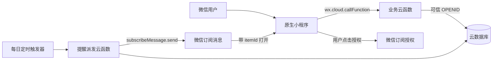
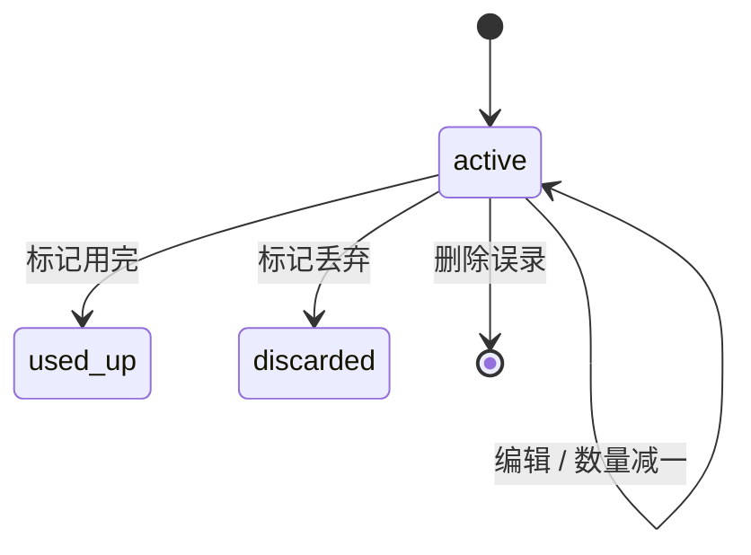

# 保质期助手 MVP 技术方案

> 版本：V0.1
> 日期：2026-09-06
> 依据：[MVP 产品设计文档](./mvp-product-design.md)

## 1. 方案结论

首版采用 **微信原生小程序 + 微信云开发（云数据库、云函数、定时触发器、订阅消息云调用）**。

该方案不自建登录、服务器和运维体系，微信身份直接作为用户隔离依据，能够用较少模块跑通：

`录入物品 → 查看临期状态 → 订阅提醒 → 标记用完或丢弃`

技术上的重点不是页面数量，而是以下四件事：

1. 所有日期按“自然日”计算，不能被时区和时间戳偏移影响。
2. 所有数据访问都在服务端校验微信用户身份，不能信任前端传入的用户标识。
3. 数量变更、库存状态转换和提醒取消要保持一致。
4. 订阅提醒采用“一物品一个提醒任务、最多尝试发送一次”的策略，优先保证不重复发送。

## 2. 范围与关键约定

### 2.1 本方案覆盖

- 首页概览、库存列表、搜索和筛选
- 物品新增、编辑、详情、减量、用完、丢弃和误录删除
- 默认设置和历史记录
- 小程序内临期状态
- 用户主动授权后的微信订阅提醒
- 用户隔离、异常处理、日志、基础埋点和发布验收

### 2.2 明确不建设

- 独立账号、手机号登录和用户资料系统
- 自建 HTTP 后端、关系型数据库和管理后台
- OCR、条码、图片上传、家庭共享和复杂报表
- Redux 一类全局状态库、第三方 UI 组件库、微服务和消息队列
- 离线编辑及多端实时同步

### 2.3 产品文档未明确、首版需要固定的规则

| 项目 | 首版约定 | 原因 |
| --- | --- | --- |
| 首页数量 | 按“物品记录数/品项数”统计，不累加 `quantity` | 临期概览关注需要处理的品项，避免“2 瓶牛奶”被误解为两个独立到期任务 |
| 保质期单位 | 支持天、月、年 | 覆盖食品、药品和日化的常见标签 |
| 月/年换算 | 按日历加法；目标月份没有对应日期时取该月最后一天 | 例如 1 月 31 日加 1 个月得到 2 月最后一天 |
| 提醒发送时间 | 每天 09:00，固定按 `Asia/Shanghai` 业务时区 | 首版没有提醒时刻设置，固定时间便于理解和验证 |
| 数量减至 0 | 使用中物品保持 `quantity >= 1`；数量为 1 时再次减量，先确认并直接转为“已用完” | 避免产生“数量为 0 但仍在库存中”的矛盾状态 |
| 搜索匹配 | 名称包含匹配，忽略首尾空格和英文大小写 | 符合家庭小数据量下的直觉 |

这些约定不会扩大 MVP 功能范围，但应在进入编码前由产品确认；若有调整，只影响对应领域规则，不改变总体架构。

## 3. 技术选型

| 层级 | 选择 | 说明 |
| --- | --- | --- |
| 客户端 | 微信原生小程序、TypeScript、WXML、WXSS | 页面少、交互直接；无需引入跨端框架和额外运行时 |
| UI | 原生组件 + 少量项目内组件 | 首版只抽取物品行、状态标签、空状态、确认弹层等稳定重复单元 |
| 服务端 | 微信云函数，Node.js 20、CommonJS JavaScript | 无需维护服务器和额外编译链；函数内统一鉴权、校验和状态转换 |
| 数据 | 云开发文档数据库 | 数据结构简单，适合按用户和状态查询；支持索引与事务 |
| 身份 | `cloud.getWXContext().OPENID` | 无手工注册；服务端从可信上下文获取，前端不能伪造 |
| 提醒 | `wx.requestSubscribeMessage` + `cloud.openapi.subscribeMessage.send` | 用户主动授权；云函数发送并记录一次提醒结果 |
| 调度 | 微信开发者工具/微信云开发控制台配置的定时触发器 | 每日扫描到期提醒；必须在目标环境核验触发器和时区 |
| 测试 | Vitest 单元测试 + 云函数集成测试 + 开发者工具/真机验收 | 日期和状态规则自动化，微信授权与触达使用真机闭环验证 |

云函数及依赖使用确定版本并提交 lockfile，不使用浮动的 `latest`；小程序基础库版本也固定为开发者工具和真机验证通过的稳定版本。

## 4. 总体架构



### 4.1 模块职责

| 模块 | 职责 |
| --- | --- |
| 小程序页面层 | 展示、表单交互、搜索筛选条件、加载/空/错误状态 |
| 小程序 service 层 | 封装云函数调用、统一响应和错误映射，不包含业务状态转换 |
| `inventoryApi` | 库存查询、详情、保存、减量、完成、丢弃、删除和历史记录 |
| `settingsApi` | 获取与修改默认提醒天数、默认存放位置 |
| `reminderApi` | 在订阅授权成功后登记提醒，或主动取消未发送提醒 |
| `dispatchReminders` | 定时领取到期任务、发送订阅消息、落发送结果 |
| 云数据库 | 保存库存、设置和提醒任务；不允许小程序端直接读写 |

### 4.2 数据访问原则

- 客户端只调用云函数，不直接访问业务集合。
- 业务集合的客户端权限统一设置为“无权限”。
- 云函数安全规则默认只允许已登录用户调用三个业务函数，并对客户端设置 `dispatchReminders.invoke = false`；定时触发器不受客户端调用规则影响。
- 每个用户调用的云函数都从 `cloud.getWXContext()` 读取 `OPENID`，忽略并拒绝客户端提交的 `ownerId/openid`。
- 每一次读、改、删都同时带 `ownerId = OPENID` 条件；只按 `_id` 查询后直接更新是不允许的。
- 服务端负责字段白名单、枚举、长度、日期和状态转换校验。

## 5. 工程结构

```text
freshKeeper/
├─ miniprogram/
│  ├─ app.ts / app.json / app.wxss
│  ├─ pages/
│  │  ├─ home/
│  │  ├─ item-form/
│  │  ├─ item-detail/
│  │  └─ mine/
│  ├─ components/
│  │  ├─ inventory-row/
│  │  ├─ expiry-status/
│  │  └─ empty-state/
│  ├─ services/
│  │  ├─ cloud-client.ts
│  │  ├─ inventory-service.ts
│  │  ├─ settings-service.ts
│  │  └─ reminder-service.ts
│  ├─ domain/
│  │  ├─ inventory.ts
│  │  └─ expiry.ts
│  ├─ utils/
│  │  └─ date-key.ts
│  └─ types/
├─ cloudfunctions/
│  ├─ inventoryApi/
│  ├─ settingsApi/
│  ├─ reminderApi/
│  └─ dispatchReminders/
├─ tests/
│  ├─ unit/
│  └─ integration/
├─ docs/
├─ project.config.json
├─ project.private.config.json
└─ package.json
```

首版不为每个动作创建一个云函数。每个业务域保留一个入口，入口只负责解析 `action`，具体处理拆成小模块，以控制函数数量又避免单文件膨胀。

## 6. 核心数据设计

数据库字段使用英文稳定值，中文只由客户端映射展示。所有 `createdAt/updatedAt/completedAt` 使用服务端时间写入；自然日期统一存为 `YYYY-MM-DD` 字符串。

### 6.1 `inventory_items`

| 字段 | 类型 | 必填 | 说明 |
| --- | --- | --- | --- |
| `_id` | string | 是 | 数据库生成的物品 ID |
| `ownerId` | string | 是 | 云函数从 `OPENID` 写入，不接受前端赋值 |
| `name` | string | 是 | 去首尾空格，1～40 字符 |
| `searchName` | string | 是 | 供搜索使用的规范化名称 |
| `quantity` | integer | 是 | 使用中为 1～9999；完成后允许为 0 |
| `unit` | string | 是 | 默认“件”，1～8 字符 |
| `category` | enum | 是 | `food/medicine/household/other` |
| `storageLocation` | string | 否 | 用户自定义存放位置，最长 20 个字符；空值表示未填写 |
| `expiryInputMode` | enum | 是 | `direct/shelf_life` |
| `productionDate` | date-key/null | 否 | 生产日期 |
| `shelfLifeValue` | integer/null | 否 | 保质期数值 |
| `shelfLifeUnit` | enum/null | 否 | `day/month/year` |
| `expiryDate` | date-key | 是 | 直接输入或服务端计算后的到期日 |
| `reminderLeadDays` | integer | 是 | 0～30，默认读取用户设置，初始为 3 |
| `inventoryStatus` | enum | 是 | `active/used_up/discarded` |
| `version` | integer | 是 | 乐观并发版本，从 1 开始 |
| `createdAt` | server date | 是 | 创建时间 |
| `updatedAt` | server date | 是 | 更新时间 |
| `completedAt` | server date/null | 否 | 用完或丢弃时间 |

不保存“已过期/3 天内到期”等临期状态。这些状态必须由 `expiryDate` 和当天日期实时计算。

### 6.2 `user_settings`

| 字段 | 类型 | 说明 |
| --- | --- | --- |
| `_id` | string | 使用 `OPENID`，仅服务端可见 |
| `ownerId` | string | 与当前用户一致 |
| `defaultReminderLeadDays` | integer | 0～30，默认 3 |
| `defaultStorageLocation` | enum/null | 未设置时由表单展示“其他”或空选择 |
| `createdAt/updatedAt` | server date | 服务端时间 |

用户首次进入不强制创建设置记录；查询不到时由服务端返回默认值，首次修改时再写入。

### 6.3 `reminder_jobs`

每个物品最多保留一条提醒任务，`_id` 直接使用 `itemId`，因此编辑到期日只更新原任务，不会生成重复任务。

| 字段 | 类型 | 说明 |
| --- | --- | --- |
| `_id` | string | 等于 `itemId` |
| `itemId` | string | 关联库存物品 |
| `ownerId` | string | 提醒接收用户 |
| `templateId` | string | 服务端环境配置，不接受客户端提交 |
| `remindDate` | date-key | `expiryDate - reminderLeadDays` |
| `status` | enum | `scheduled/sending/sent/failed/unknown/cancelled` |
| `acceptedAt` | server date | 用户本次同意订阅的时间 |
| `sendAttemptedAt` | server date/null | 首次调用发送接口前写入 |
| `sentAt` | server date/null | 微信接口明确返回成功时写入 |
| `failureCode` | string/null | 脱敏后的微信错误码或内部错误码 |
| `failureReason` | string/null | 可排障的简短信息，不存用户敏感数据 |
| `updatedAt` | server date | 更新时间 |

任务本身同时承担产品文档中的“提醒记录”职责，首版不再建立重复的发送日志集合。云函数平台日志用于排查请求细节，数据库只保存业务结果。

### 6.4 索引

至少创建以下复合索引，并在开发、生产环境分别核验：

```text
inventory_items: ownerId + inventoryStatus + expiryDate ASC
inventory_items: ownerId + inventoryStatus + category + expiryDate ASC
inventory_items: ownerId + inventoryStatus + storageLocation + expiryDate ASC
inventory_items: ownerId + inventoryStatus + category + storageLocation + expiryDate ASC
inventory_items: ownerId + inventoryStatus + completedAt DESC
reminder_jobs:   status + remindDate ASC
```

名称包含搜索先限制在当前用户和当前库存状态内，再进行转义后的正则匹配。家庭库存数据量较小，首版不引入全文检索服务；若单用户有效品项明显超过 500，再根据真实数据评估前缀索引或搜索服务。

## 7. 日期与临期规则

### 7.1 日期表示

- 业务自然日只使用严格格式 `YYYY-MM-DD`。
- 禁止直接使用 `Date.parse('YYYY-MM-DD')` 参与业务判断。
- 日期工具先校验年月日，再转换为“UTC 日序号”做加减，避免本地时区和夏令时造成偏移。
- `today` 由云函数按 `Asia/Shanghai` 得出并随接口返回；首页每次 `onShow` 重新拉取，跨日后不沿用旧状态。

### 7.2 到期日计算

```text
direct:
  expiryDate = 用户选择的到期日

shelf_life + day:
  expiryDate = productionDate + N 个自然日

shelf_life + month/year:
  expiryDate = 日历加 N 月/年；若目标日不存在，收敛到目标月最后一天
```

服务端重新计算到期日，不能使用前端提交的计算结果作为最终值。

### 7.3 临期状态

令 `daysLeft = ordinal(expiryDate) - ordinal(today)`：

| 条件 | 状态值 | 展示示例 |
| --- | --- | --- |
| `< 0` | `expired` | 已过期 3 天 |
| `= 0` | `due_today` | 今天到期 |
| `1..3` | `due_in_3_days` | 还有 2 天 |
| `4..7` | `due_in_7_days` | 7 天内到期 |
| `> 7` | `safe` | 暂时安全 |

列表先按以上状态顺序分组，组内按 `expiryDate ASC, createdAt DESC` 排序。只有 `inventoryStatus = active` 的记录参与首页概览和列表。

## 8. 云函数接口

所有接口统一返回：

```ts
type ApiResult<T> =
  | { ok: true; data: T; requestId: string }
  | { ok: false; error: { code: string; message: string }; requestId: string };
```

不把数据库异常、堆栈、`OPENID` 或微信接口原始报文返回客户端。

### 8.1 `inventoryApi`

| action | 输入要点 | 输出/行为 |
| --- | --- | --- |
| `listActive` | 搜索词、分类、位置、游标、页大小 | 当前页、全量有效库存概览、状态展示字段、下一游标和 `serverToday` |
| `get` | `itemId` | 当前用户的物品详情；不存在或不属于当前用户均返回 `NOT_FOUND` |
| `save` | 新增字段，编辑时增加 `itemId/version` | 服务端校验并计算到期日；编辑时检查版本 |
| `decrement` | `itemId/version` | 数量大于 1 时原子减一；等于 1 时返回 `REQUIRES_COMPLETION_CONFIRM` |
| `complete` | `itemId/version` | 事务内改为 `used_up`、数量置 0、写完成时间、取消待发提醒 |
| `discard` | `itemId/version` | 事务内改为 `discarded`、写完成时间、取消待发提醒 |
| `delete` | `itemId/version` | 二次确认后硬删除误录记录，同时取消/删除未发送提醒 |
| `listHistory` | 搜索词、状态、游标 | 用完/丢弃记录，按 `completedAt DESC` 分页 |

编辑、减量、完成和丢弃都检查 `version`。版本不一致返回 `CONFLICT`，客户端提示“记录已更新，请刷新后重试”，不静默覆盖。

概览统计始终表示该用户的全部有效库存，不随当前搜索词和筛选条件变化；搜索和筛选只影响下方列表，避免用户误把筛选结果当成总体库存。

### 8.2 `settingsApi`

| action | 行为 |
| --- | --- |
| `get` | 返回已保存设置或服务端默认值 |
| `update` | 仅允许更新默认提醒天数和默认存放位置 |

“提醒授权状态”不能简单保存成永久布尔值。页面应展示：平台设置入口说明，以及当前物品是否存在 `scheduled/sent` 任务；真正能否发送最终由微信订阅额度决定。

“我的”页面可用 `wx.getSetting({ withSubscriptions: true })` 读取系统订阅总开关和模板设置用于解释当前状态，但不能把该结果当作剩余发送次数；一次性订阅的可用额度仍由微信平台在发送时判定。

### 8.3 `reminderApi`

| action | 行为 |
| --- | --- |
| `arm` | 用户授权结果为 `accept` 后调用；服务端再次读取物品、计算 `remindDate` 并创建或更新任务；`sent/unknown/sending` 任务不可重新开启 |
| `cancel` | 将未发送任务改为 `cancelled`，已发送任务保持历史结果 |

客户端流程必须是：用户点击“开启本次临期提醒”后立即调用 `wx.requestSubscribeMessage`；拒绝、关闭或接口失败只反馈提醒未开启，不影响物品数据。

授权调用前不能插入网络请求或其他异步等待。一次 `accept` 只对应一次性模板的一次发送额度；服务端以一个物品的一条任务消费该额度。若计划提醒日已经过去但物品尚未过期，任务仍以原 `remindDate` 进入待派发范围，在下一次定时批次处理；已过期物品不再允许新开提醒。

### 8.4 `dispatchReminders`

- 仅允许定时触发，不开放给小程序端调用。
- 每天 09:00 扫描 `status = scheduled AND remindDate <= today` 的任务，按页处理。
- 发送前重新读取物品并验证：属于该用户、仍为 `active`、日期仍匹配；否则取消任务。
- 通过事务/条件更新将任务从 `scheduled` 原子改为 `sending`，只有领取成功的执行实例可以发送。
- 写入 `sendAttemptedAt` 后调用微信发送接口；成功改为 `sent`，明确拒绝改为 `failed`。
- 网络超时或返回结果不确定时改为 `unknown`，不自动重试，避免用户收到重复消息。
- 定时器可能重复触发，因此不能依赖“每天只运行一次”来保证幂等。
- 消息模板至少表达物品名称、到期日期和临期提示；字段名以公众平台实际申请结果为准，服务端集中做字段映射、长度裁剪和页面路径拼装。

这里选择“至多发送一次”，而不是自动重试保证“至少送达一次”。订阅消息接口和函数调用之间不存在分布式事务，结果不确定时无法同时绝对保证不漏发和不重复；产品已明确要求同一提醒不得重复发送，因此首版优先满足不重复。

## 9. 关键业务流程

### 9.1 新增物品

1. 表单加载用户默认值。
2. 用户选择直接到期日，或生产日期 + 保质期。
3. 客户端做即时格式校验，提交到 `inventoryApi.save`。
4. 服务端做相同且更严格的白名单校验，计算 `expiryDate` 并写库。
5. 成功后返回首页；首页刷新概览和列表。
6. 是否订阅提醒是独立操作，任何授权结果都不能回滚物品保存。

### 9.2 编辑物品

1. 详情携带 `itemId` 拉取服务端最新数据。
2. 保存时携带 `version`。
3. 到期日或提前天数发生变化时，事务内更新未发送提醒的 `remindDate`。
4. `sent/unknown` 是该物品提醒的终态，编辑物品也不创建第二条提醒；只有明确未发送的 `failed/cancelled` 任务才允许用户再次点击并授权。

### 9.3 处理库存



`used_up` 和 `discarded` 是终态，首版不提供恢复入口。完成操作同步取消 `scheduled` 提醒，派发函数发送前仍会二次验证库存状态，防止并发情况下误发。

### 9.4 订阅提醒

1. 详情页按钮的同步点击回调内请求订阅授权。
2. `accept` 后调用 `reminderApi.arm`；`reject/ban` 仅提示并给出系统设置说明。
3. `arm` 以物品 ID 为唯一键保存一条待发任务。
4. 定时函数领取到期任务并发送。
5. 消息跳转路径使用 `pages/item-detail/index?id=<itemId>&source=subscribe`。
6. 详情页验证该物品属于当前用户；记录 `reminder_open_detail` 埋点。

## 10. 客户端实现

### 10.1 页面数据策略

- 首页 `onShow` 拉取最新概览与首屏列表，新增/编辑/处理后通过“脏标记”触发刷新；页面持续停留跨过 00:00 时也主动刷新一次。
- 搜索输入做约 300ms 防抖；筛选变更立即查询。
- 列表按游标分页，默认每页 30 条，避免一次加载全部历史。
- 不做复杂本地缓存；网络失败时保留当前已展示内容并提供重试，不能把旧内容伪装成最新结果。
- 每个页面显式维护 `loading/empty/error/content` 四类状态，提交按钮防重复点击。

### 10.2 表单校验

- 名称：去首尾空格后 1～40 字符。
- 数量：整数 1～9999。
- 单位：去首尾空格后 1～8 字符。
- 保质期：正整数；计算结果必须是有效日期。
- 提前提醒：整数 0～30 天。
- 两种到期录入模式互斥；切换模式时清理另一模式的无效字段。
- 服务端永远重新校验，客户端校验只用于更快反馈。

### 10.3 可访问性与交互

- 临期状态同时提供文字，不只依赖颜色。
- 点击区域不小于微信小程序推荐的可触达尺寸；危险操作使用系统确认弹层。
- 保存、处理和授权均给出明确成功/失败反馈。
- 空库存、无搜索结果和网络失败使用不同文案及操作入口。
- 首页固定新增入口不遮挡最后一条列表内容，并适配安全区。

## 11. 安全、隐私与可靠性

### 11.1 安全

- 业务集合关闭客户端直读直写，只允许云函数访问。
- 不接受客户端传入的用户 ID、模板 ID、完成时间和创建时间。
- 所有字符串做长度限制；名称搜索的正则字符先转义。
- 云函数按最小权限声明 `subscribeMessage.send`，非派发函数不拥有发送权限。
- 开发、生产使用独立云环境和订阅模板配置，禁止把密钥写入仓库或小程序包。
- 日志只记录 `requestId`、action、结果码、耗时和脱敏资源 ID，不打印完整物品名称、OPENID 或订阅报文。

### 11.2 一致性

- 多字段状态变化使用数据库事务。
- 修改接口使用 `version` 防止多端覆盖。
- 派发前检查任务状态和库存状态，领取任务使用条件更新。
- 完成/删除与提醒取消即使因异常未能同事务完成，派发函数的二次校验也会阻止发送。

### 11.3 降级

- 云函数或网络失败：保留页面内容，显示重试，不在本地假装保存成功。
- 订阅授权拒绝：物品正常保存和使用，小程序内临期展示不受影响。
- 订阅发送失败：记录状态；首页和详情仍以实时日期显示临期信息。
- 定时器异常：通过云函数失败日志和控制台告警发现，恢复后只处理仍为 `scheduled` 的任务。

## 12. 指标与埋点

首版的客户端行为使用微信小程序自定义分析能力记录，云端发送结果直接从 `reminder_jobs` 汇总；不建设独立分析后台，不上传物品名称等业务内容。

| 指标来源 | 事件/数据 | 触发时机或口径 | 用途 |
| --- | --- | --- | --- |
| 客户端分析 | `app_open` | 小程序进入前台 | 打开与 7 日回访 |
| 客户端分析 | `item_create_success` | 首次/后续新增成功 | 首次新增转化、有效录入量 |
| 客户端分析 | `item_used_up` | 标记用完成功 | 临期处理率 |
| 客户端分析 | `item_discarded` | 标记丢弃成功 | 临期处理率与浪费代理指标 |
| 客户端分析 | `reminder_request_result` | 用户接受/拒绝/禁止授权 | 授权率 |
| 业务数据库 | `reminder_jobs.status` | `sent/failed/unknown` 数量 | 发送成功率与异常排查 |
| 客户端分析 | `reminder_open_detail` | 从订阅消息打开详情 | 消息打开率 |

库存和提醒结果以业务数据库为准，行为漏斗以平台分析为准。埋点失败不得阻塞任何核心操作。

## 13. 测试与验收

### 13.1 单元测试重点

- 闰年、月末、跨年、生产日期加天/月/年的到期日计算。
- 到期日前后边界：`-1/0/1/3/4/7/8` 天。
- `YYYY-MM-DD` 严格解析及不同时区运行结果一致。
- 表单字段白名单、枚举和长度限制。
- `active → used_up/discarded` 合法转换与非法重复转换。
- 数量为 1 时的完成确认规则。
- 提醒日期重算、领取幂等和发送状态转换。

### 13.2 云环境集成测试

- 用户 A 无法读写用户 B 的物品、历史和提醒。
- 并发提交相同 `version` 时只有一次成功。
- 编辑到期日会更新未发送任务，完成物品会取消任务。
- 重复触发派发函数时同一任务只被领取一次。
- 数据库索引在开发环境全部生效，没有全表扫描或缺索引异常。
- 云函数定时触发器来自微信开发者工具/微信云开发配置，控制台显示的时区与 09:00 预期一致。

### 13.3 真机核心验收

| 产品验收项 | 技术验证 |
| --- | --- |
| 新增、查看、编辑、删除 | 两种日期模式各完成一次；删除二次确认 |
| 约 20 秒完成新增 | 使用默认值，从打开新增页到保存成功做真机计时，不包含首次订阅授权 |
| 临期分组、统计、排序 | 准备覆盖五类状态的固定测试数据核对 |
| 搜索、分类、位置筛选 | 分别及组合验证，清空后恢复全部 |
| 减量、用完、丢弃、历史 | 数量 2→1、数量 1→完成、丢弃各走一次 |
| 拒绝提醒仍可使用 | 真机拒绝授权后继续新增和编辑 |
| 提醒不重复 | 临时缩短触发周期，连续触发两次，只收到一次 |
| 重启数据仍存在 | 杀掉微信进程后重新进入核对 |
| 用户隔离 | 两个微信账号分别创建数据核对 |
| 完整闭环 | 正式发布前在真机完成产品文档定义的全流程 |

订阅授权弹窗、系统设置状态、消息触达和消息跳转不能仅凭开发者工具模拟器判定通过，必须以真机结果为准。

## 14. 开发顺序

### 阶段 1：库存最小闭环

- 初始化原生 TypeScript 小程序和开发/生产云环境配置。
- 建立数据集合、权限和索引。
- 完成日期领域函数及单元测试。
- 完成首页、新增/编辑、详情和基础 CRUD。

完成标准：不接提醒也能稳定完成“录入 → 查看临期 → 处理”。

### 阶段 2：状态与设置

- 完成减量、用完、丢弃和历史记录。
- 完成默认设置、搜索和筛选。
- 加入并发版本、错误态和核心埋点。

完成标准：除微信消息外，产品验收项全部通过。

### 阶段 3：订阅提醒

- 申请并固定订阅消息模板字段。
- 完成授权、任务登记、取消、派发和幂等状态机。
- 在微信开发者工具/云开发控制台配置定时触发器及 OpenAPI 权限。
- 使用体验版和真机验证真实消息与跳转。

完成标准：拒绝授权不影响库存；接受后只发送一次并正确落详情页。

### 阶段 4：发布验收

- 完成两账号隔离、弱网、跨日、并发和真机全流程验证。
- 检查云函数错误日志、告警、数据库索引和环境配置。
- 核对隐私说明、类目、订阅模板和小程序审核材料。

## 15. 主要风险与处理

| 风险 | 影响 | 处理 |
| --- | --- | --- |
| 订阅消息是一次性授权 | 用户未授权或额度已消费时不能发送 | 明确“一物品一次提醒”，只在用户点击时请求；小程序内状态始终可用 |
| 定时云调用配置错误 | 定时函数有数据但无法调用微信接口 | 从微信开发者工具配置触发器，声明 OpenAPI 权限，在体验版真机验证并检查 `missing wxCloudApiToken` |
| 定时器重复触发 | 可能重复发送 | 原子领取 + 至多一次发送状态机，不以触发次数作为幂等保证 |
| 自然日受时区影响 | 临期分组错一天 | 固定业务时区，使用 date-key 和日序号，禁止直接解析日期字符串 |
| 用户多端同时编辑 | 数量或状态被覆盖 | `version` 乐观锁和事务，冲突后刷新 |
| 名称包含搜索变慢 | 数据增长后首页延迟 | 先限定用户与状态；首版监控数据量，达到阈值后再升级搜索方案 |
| 模板字段或页面路径变化 | 消息发送失败或无法跳转 | 模板和跳转路径按环境配置，发布前用正式候选版本真机回归 |

## 16. 发布与运维检查单

- 开发、生产云环境严格分离，环境 ID 与消息模板映射正确。
- 三个业务集合权限均禁止客户端直接访问。
- 数据库复合索引已创建且状态正常。
- 云函数依赖已锁定，Node.js 运行时和内存/超时配置已确认。
- `dispatchReminders` 只允许定时触发，已声明 `subscribeMessage.send` 权限。
- 控制台核对定时器时区，并通过临时每分钟触发完成验证后恢复每日 09:00。
- 订阅消息的 `miniprogramState` 在开发、体验、正式环境分别正确。
- 云函数错误率和定时任务失败已配置告警。
- 正式版发布前完成至少一次双账号隔离测试和一次订阅消息真机闭环。

## 17. 官方依据

- [CloudBase 云函数概述](https://docs.cloudbase.net/cloud-function/introduce)
- [在微信小程序中调用 CloudBase 云函数](https://docs.cloudbase.net/recipes/add-cloud-function-wechat-miniprogram)
- [CloudBase 数据库基础权限](https://docs.cloudbase.net/database/data-permission)
- [CloudBase 数据库安全规则](https://docs.cloudbase.net/en/database/security-rules/)
- [CloudBase 定时触发器](https://docs.cloudbase.net/cloud-function/timer-trigger)
- [CloudBase 云函数安全规则](https://docs.cloudbase.net/cloud-function/security-rules)
- [微信小程序 requestSubscribeMessage](https://developers.weixin.qq.com/miniprogram/dev/api/open-api/subscribe-message/wx.requestSubscribeMessage.html)
- [微信云调用 subscribeMessage.send](https://developers.weixin.qq.com/miniprogram/dev/wxcloud/reference-sdk-api/open/subscribeMessage/Cloud.openapi.subscribeMessage.send.html)
- [定时云调用缺少 wxCloudApiToken 的说明](https://docs.cloudbase.net/faq/knowledge/missing-wxcloudapitoken-error)
- [云调用 OpenAPI 权限声明](https://docs.cloudbase.net/faq/knowledge/cloud-call-604101-permission-error)
