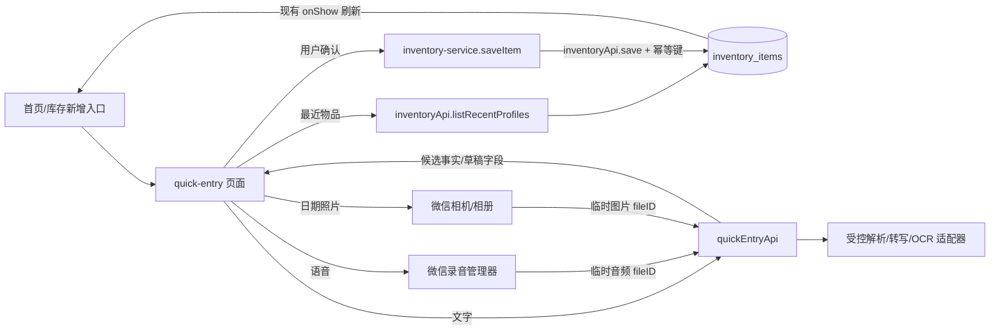

# 保质期助手快速录入技术方案

> 版本：V0.1
> 状态：快速录入产品设计的实施方案
> 更新日期：2026-09-08
> 产品依据：[快速录入产品设计](./quick-entry-product-design.md)
> 现有技术基线：[MVP 技术方案 2](./mvp-technical-design-v2.md)

## 1. 方案结论

快速录入继续使用当前的 **微信原生小程序 + 微信云开发**，不引入前端框架、客户端全局状态库或新的库存数据模型。

本方案的核心边界如下：

1. 新增 `pages/quick-entry` 作为新增物品的统一入口。页面只维护本次会话中的临时草稿，不把草稿写入 `inventory_items`。
2. P0 最近物品从现有 `inventory_items` 的 `active`、`used_up` 记录生成，由现有 `inventoryApi` 增加只读 action；删除、回收站和旧版丢弃记录不参与。
3. P1 的文字解析、语音转写和日期照片识别由新的 `quickEntryApi` 负责调用受控的服务端适配器。小程序端不保存密钥、不直接调用模型或 OCR 服务。
4. 识别结果始终是候选草稿。草稿必须经过页面校验和用户确认，最终转换为现有 `InventorySaveInput`，继续调用 `inventoryApi.save`。
5. 为快速录入保存增加服务端幂等键。多条草稿部分失败时只重试失败项，网络结果不确定时不会因为重复点击创建第二条库存记录。
6. 日期解释和到期日计算由确定性的日期模块完成，模型只能提取日期事实，不能直接决定最终日期，也不能绕过现有服务端校验。

本方案不新增草稿集合、提醒任务或库存状态。快速录入完成后，库存、首页统计、提醒和历史继续由现有业务链路负责。

## 2. 当前基线与改造边界

### 2.1 当前代码事实

| 能力 | 当前实现 | 对快速录入的约束 |
| --- | --- | --- |
| 新增入口 | `miniprogram/pages/home/index.ts`、`miniprogram/pages/inventory/index.ts` 的 `addItem` 直接跳转 `item-form` | 改为进入 `quick-entry`；编辑和恢复不改变 |
| 完整表单 | `miniprogram/pages/item-form/` | 继续作为手动兜底、编辑和重新入库入口 |
| 保存客户端 | `miniprogram/services/inventory-service.ts` 的 `saveItem` | 快速草稿最终只能通过它保存 |
| 服务端保存 | `cloudfunctions/inventoryApi/index.js` 的 `save` | 继续做字段白名单、用户隔离、日期计算和提醒更新 |
| 字段契约 | `miniprogram/types/inventory.ts` 的 `InventorySaveInput` | 草稿转换时不能创建第二套库存字段 |
| 默认提醒 | `settings-service.ts` + `settingsApi`，读取失败时表单默认 `1` 天 | 快速录入一次读取并沿用同一兜底 |
| 日期规则 | `miniprogram/utils/date-key.ts` 与 `cloudfunctions/inventoryApi/date.js` | 解析结果必须交给现有自然日规则 |
| 统计与列表 | `getOverview`、`listInventory` 已在 `inventoryApi` 中实现 | 快速保存成功后沿用页面 `onShow` 刷新 |
| 埋点 | `miniprogram/utils/analytics.ts` | 只能记录结果枚举、耗时和数量，不上传原文或媒体 |
| 权限与媒体 | 当前没有录音、相机、相册、上传和 OCR 能力 | 作为 P1 新增，必须单独做真机验证 |

### 2.2 本方案建设内容

- 快速录入页及草稿卡片。
- 最近物品服务端查询、规范化去重和复用映射。
- 文字解析协议、日期事实归一化和多草稿管理。
- 语音录音、转写和文字解析复用链路。
- 日期照片上传、OCR 结果归一化和候选确认。
- 快速录入保存的幂等、部分成功和失败重试。
- 快速录入相关类型、服务、云函数、索引、测试和发布检查。

### 2.3 明确不建设

- 不把草稿、原始文本、音频、照片或 OCR 原文写入业务集合。
- 不在快速录入中编辑已有库存，不复用 `itemId/version` 作为新草稿身份。
- 不做包装正面商品识别、条码、商品库、开封周期和小票识别。
- 不从商品常识、最近记录或模型推断缺失的到期日。
- 不在识别成功后跳过确认直接入库。
- 不增加连续拍摄、批量媒体队列、跨进程草稿恢复或模板管理。
- 不改变现有提醒授权、提醒派发、库存处理和历史记录规则。

## 3. 总体架构



### 3.1 服务边界

`inventoryApi` 是库存事实的唯一拥有者。它负责：

- 查询最近物品资料。
- 校验和保存最终库存字段。
- 根据服务端上海自然日计算 `expiryDate`。
- 创建库存记录后继续沿用现有版本和提醒事务。

`quickEntryApi` 是临时识别能力的边界。它负责：

- 接收受限长度的文字，或处理一次性媒体 `fileID`。
- 调用服务端配置的文本、语音和 OCR 适配器。
- 校验第三方输出格式并转换为产品定义的日期事实。
- 在响应前删除临时媒体，绝不写入 `inventory_items`。

`quickEntryApi` 不拥有库存写入权限；即使解析服务返回“完整物品”，也只能返回候选数据。

### 3.2 依赖与版本

- 小程序继续使用原生 TypeScript、WXML、WXSS，基础库基线为 `3.8.10`。
- 业务云函数继续使用 Node.js 20、CommonJS 和 `wx-server-sdk@4.0.2`。
- `quickEntryApi` 首版不引入模型厂商 SDK，使用 Node 20 的 HTTPS/fetch 适配器；第三方 API 的密钥只配置在云函数环境变量。
- 每个 provider 都通过本地适配器隔离。更换文本模型、语音服务或 OCR 服务时，不改页面和 `InventorySaveInput`。
- 任何依赖基础库能力的实现，必须在开发者工具和真机上以 `3.8.10` 重新核对，不以文档中的默认版本推断可用。

## 4. 工程结构与模块职责

```text
miniprogram/
├─ pages/
│  ├─ quick-entry/
│  │  ├─ index.ts
│  │  ├─ index.wxml
│  │  ├─ index.wxss
│  │  └─ index.json
│  ├─ item-form/                 # 手动新增、编辑、重新入库
│  ├─ home/                      # 新增入口改跳 quick-entry
│  └─ inventory/                 # 新增入口改跳 quick-entry
├─ components/
│  └─ quick-entry-draft/          # 单条草稿的状态、日期和更多字段
├─ domain/
│  └─ quick-entry.ts             # 纯函数：草稿映射、状态、日期候选合并
├─ services/
│  ├─ quick-entry-service.ts     # 最近项、解析、媒体识别、逐条保存
│  └─ inventory-service.ts       # 增加 listRecentProfiles 和幂等参数
├─ types/
│  ├─ quick-entry.ts
│  └─ inventory.ts               # 仅增加保存调用所需的非业务类型
└─ config/runtime.ts             # P0/P1 能力开关，不放密钥

cloudfunctions/
├─ inventoryApi/
│  ├─ index.js                   # 增加 listRecentProfiles、快速保存幂等
│  ├─ recent.js                  # 名称规范化和最近资料合并
│  └─ idempotency.js             # 稳定新建 ID 和幂等判断
└─ quickEntryApi/
   ├─ index.js
   ├─ validation.js
   ├─ date-facts.js              # 日期事实归一化，不依赖模型结果
   ├─ providers/
   │  ├─ text.js
   │  ├─ speech.js
   │  └─ date-ocr.js
   ├─ package.json
   ├─ package-lock.json
   └─ config.json

tests/unit/
├─ quick-entry.test.ts
├─ quick-entry-date.test.ts
├─ quick-entry-service.test.ts
└─ cloud-domain.test.ts          # 增加最近项和幂等规则
```

不把所有快速录入逻辑塞进 `item-form`。`item-form` 继续承担完整表单的稳定职责，快速录入只在进入完整表单时传递一次性、已校验的草稿字段。

## 5. 类型与临时草稿模型

### 5.1 来源和状态

```ts
type QuickEntrySource = 'recent' | 'text' | 'voice' | 'date_photo' | 'manual'

type QuickDraftStatus =
  | 'recognizing'
  | 'needs_input'
  | 'needs_confirmation'
  | 'savable'
  | 'saving'
  | 'saved'
  | 'failed'

type QuickDraftIssueCode =
  | 'MISSING_NAME'
  | 'MISSING_EXPIRY'
  | 'INVALID_FIELD'
  | 'AMBIGUOUS_DATE'
  | 'DATE_CONFLICT'
  | 'UNSUPPORTED_OPENED_PERIOD'
  | 'OCR_NO_DATE'
  | 'TOO_MANY_DRAFTS'
  | 'SERVICE_UNAVAILABLE'
```

`partial_failure` 是页面级结果，不替代单条草稿的 `failed` 状态。已保存草稿进入 `saved` 后不再参与重试。

### 5.2 草稿字段

```ts
interface QuickDraftFields {
  name: string
  quantity: number | null
  unit: string
  category: Category | null
  storageLocation: string
  expiryInputMode: ExpiryInputMode
  productionDate: string | null
  shelfLifeValue: number | null
  shelfLifeUnit: ShelfLifeUnit | null
  expiryDate: string | null
  reminderLeadDays: number | null
}

interface QuickEntryDraft {
  draftId: string                 // 页面内身份，不是库存 itemId
  saveKey: string                 // 本条草稿整个会话内稳定的幂等键
  source: QuickEntrySource
  status: QuickDraftStatus
  fields: QuickDraftFields
  issues: Array<{ code: QuickDraftIssueCode; field?: string; message: string }>
  selected: boolean
  dateCandidates: DateCandidate[]
  evidence?: { kind: 'text' | 'photo'; localPath?: string; sourceText?: string }
  errorMessage?: string
}
```

`QuickDraftFields` 允许缺失值，`InventorySaveInput` 不允许缺失值。只有 `toInventorySaveInput(draft)` 通过后，才可以调用 `saveItem`。草稿类型不得直接断言为库存类型。

### 5.3 最近资料

最近资料只返回可复用字段，不返回日期、`_id`、`version`、库存状态、创建时间或提醒任务：

```ts
interface RecentItemProfile {
  name: string
  quantity: number
  unit: string
  category: Category
  storageLocation: string
  reminderLeadDays: number
  expiryInputMode: ExpiryInputMode
  shelfLifeValue: number | null
  shelfLifeUnit: ShelfLifeUnit | null
}
```

如果历史记录已经是 `used_up`，当前代码会将数量写为 `0`。这类资料仍可作为名称和配置来源，但新草稿的数量回退为 `1`，并标记 `INVALID_FIELD`，避免把 `0` 带入保存。

## 6. P0 最近物品实现

### 6.1 服务端查询

在 `inventoryApi` 增加 `listRecentProfiles` action：

```ts
interface ListRecentProfilesResult {
  items: RecentItemProfile[] // 最多 6 项
}
```

处理规则：

1. `ownerId` 只取 `cloud.getWXContext().OPENID`。
2. 只查询 `inventoryStatus in ['active', 'used_up']`；不查询 `deleted`、`discarded`。
3. 分别按 `updatedAt DESC` 查询两种状态，服务端做归并排序，保证“最近保存或更新”的记录优先。
4. 以服务端名称规范化结果去重，直到得到 6 个唯一名称或两路数据读完。不能只取固定前 6 条后再去重，否则同名记录会导致旧的唯一物品消失。
5. 展示字段使用该规范化名称对应的最新记录。原记录中的日期全部不返回。
6. 读取失败只影响最近物品区域；客户端仍可使用文字、照片或完整填写入口。

名称 key 的规范化规则与产品稿一致：

```text
Unicode NFKC
→ 去除首尾空白
→ 连续空白折叠为一个半角空格
→ 拉丁字母统一小写
```

不删除有意义的内部空格，不做模糊相似合并。因此 `C-100` 与 `c-100` 去重，`牛奶 250ml` 与 `牛奶250ml` 不去重。

### 6.2 索引

在开发、体验和生产云环境创建：

```text
inventory_items: ownerId ASC, inventoryStatus ASC, updatedAt DESC
```

现有库存和历史索引继续保留。最近查询不依赖 `searchName` 正则，也不把最近资料缓存到本地 Storage。

### 6.3 客户端复用映射

点击最近项后，`createDraftFromRecent` 执行以下映射：

| 字段 | 映射 |
| --- | --- |
| 名称、数量、单位、分类、位置、提醒天数 | 复制；不合法值回退当前新增默认并标记待确认 |
| `expiryInputMode` | 复制 |
| `shelfLifeValue`、`shelfLifeUnit` | 仅 `shelf_life` 模式复制 |
| 生产日期、到期日期 | 永远设为 `null`/空字符串 |
| `itemId`、`version`、库存状态 | 不创建、不复制 |

直接到期模式的草稿在日期区域显示空的到期日期；保质期模式只保留保质期数值和单位，生产日期为空。旧日期不能以 placeholder、折叠值或默认值出现。

点击后立即把焦点或滚动位置放到日期区域。用户选择日期后，草稿才从 `needs_input` 变为 `savable`。

### 6.4 无最近项与旧服务端兼容

- P0 只有最近复用能力时：最近列表为空，直接 `redirectTo` 当前 `item-form`，不展示只有“完整填写”按钮的中间页。
- P1 任一智能入口开放后：始终展示快速录入页，最近区域为空时隐藏该区域。
- `listRecentProfiles` 尚未部署或返回 `INVALID_ACTION` 时，隐藏最近区域并保留完整填写；不能阻塞手动新增。
- 详情编辑和回收站重新入库仍直接进入 `item-form`，不能经过快速录入页。

## 7. 快速录入页和草稿交互

### 7.1 页面状态

```ts
{
  loadingRecent: boolean
  recentProfiles: RecentItemProfile[]
  recentError: string
  text: string
  recognitionState: 'idle' | 'parsing' | 'transcribing' | 'recognizing_photo'
  voiceState: 'idle' | 'recording' | 'cancelling' | 'uploading'
  drafts: QuickEntryDraft[]
  saving: boolean
  saveSummary: { succeeded: number; failed: number }
  features: {
    recent: boolean
    text: boolean
    voice: boolean
    datePhoto: boolean
  }
}
```

草稿只保存在当前页面内存。页面存在输入或未保存草稿时启用离开提示；不要求微信进程被杀掉后恢复。

### 7.2 入口和返回

- 首页、库存页和空状态的新增按钮统一跳转 `/pages/quick-entry/index`。
- 快速录入页的“完整填写”使用一次性内存传递合法字段到 `item-form`，不把整段原文塞进 URL，也不将原文自动当作名称。
- 这份一次性数据放在 `App.globalData.pendingQuickFormDraft`，由 `item-form.onLoad` 读取后立即清空；不写 Storage，不跨进程恢复。缺失或校验失败时仍打开普通空表单。
- `item-form` 增加 `source=quick-entry` 分支：加载合法的草稿字段，仍使用已有表单校验和保存；保存成功后返回原 Tab，不能创建第二条草稿记录。
- 草稿页面返回时保留当前页面内存状态；用户确认放弃后清空草稿和媒体引用。

### 7.3 草稿卡片

`quick-entry-draft` 组件负责单条草稿的展示和编辑：

1. 名称、到期模式和到期信息始终展开。
2. 数量、单位、分类、位置、提醒天数默认显示摘要，点击“更多信息”后使用现有选项和值域编辑。
3. `needs_input` 精确显示缺失字段；`needs_confirmation` 显示候选日期和来源文字，要求用户选择。
4. 只有 `savable` 草稿可勾选。多条草稿默认选中所有可保存项。
5. 主按钮只统计选中且可保存的草稿；没有可保存项时禁用。
6. `saving` 禁止编辑和重复提交；`saved` 显示已加入库存；`failed` 保留字段和错误原因，只提供重试或删除。

### 7.4 草稿转库存输入

`toInventorySaveInput` 只做映射，不改变业务规则：

- 直接到期模式：发送 `expiryInputMode: 'direct'`、`expiryDate`，生产日期和保质期字段为 `null`。
- 保质期模式：发送 `expiryInputMode: 'shelf_life'`、生产日期和保质期，`expiryDate` 发送 `null`，由 `inventoryApi` 重新计算。
- 类别、数量、单位、提醒天数和名称在客户端做即时校验，服务端再次校验。
- 不确定日期不能被映射为确定日期；不完整草稿不能进入保存请求。

## 8. P1-A 文字一句话解析

### 8.1 调用链

```text
用户编辑文字
  → 点击“生成草稿”
  → quickEntryApi.parseText
  → provider 返回结构化日期事实
  → 服务端 date-facts 归一化
  → 返回 1～5 条候选草稿
  → 客户端补默认值并展示确认
```

客户端不在输入时自动调用模型，避免输入内容被持续上传。用户点击生成后，文本仍保留在输入框，失败时可以编辑后重试。

### 8.2 请求限制和服务端输出校验

请求约束：

- 原文去首尾空白后长度限制为 500 个 Unicode 字符。
- 空文本不调用服务端，直接提示输入内容。
- 服务端最多接受 5 条候选；第三方返回超过 5 条时返回 `TOO_MANY_DRAFTS`，不能静默截断。
- 服务端设置请求超时和响应大小上限，不自动无限重试。

模型/解析适配器只允许返回类似以下的事实结构，不能返回可直接写库的库存对象：

```ts
interface ProviderTextItem {
  name?: string
  quantity?: number
  unit?: string
  category?: string
  storageLocation?: string
  dateFacts: Array<{
    kind: 'expiry' | 'production' | 'shelf_life' | 'relative' | 'unknown'
    rawText: string
    year?: number
    month?: number
    day?: number
    offsetDays?: number
    value?: number
    unit?: 'day' | 'month' | 'year'
    label?: 'expiry' | 'production'
  }>
}
```

服务端对 provider 输出做 JSON schema、字段白名单、枚举、范围和字符串长度校验。无效输出视为解析失败，不把原始 JSON 传给客户端。

### 8.3 默认值与字段优先级

客户端在事实归一化后补全字段：

1. 名称、数量、单位、分类、位置：用户明确表达 > 最近同名资料 > 当前新增默认值。
2. 到期信息：用户明确表达或后续选择 > 任何历史资料；禁止猜测。
3. 提醒天数：最近同名资料 > `getSettings` 的用户设置 > `1` 天兜底。

同一次页面会话只读取一次设置；设置读取失败不阻塞草稿生成。

### 8.4 日期事实归一化

`quickEntryApi/date-facts.js` 和客户端 `domain/quick-entry.ts` 必须共享同一组测试向量。规则如下：

- 完整年月日直接生成候选日期。
- “明天”“还有 3 天”等相对表达使用本次响应的 `serverToday` 和自然日加法。
- 只有月日时选择从今天起最近一次不早于今天的日期，并明确展示补全年份。
- 只有年月、没有日时保持缺失，不能补成当月 1 日或最后一天。
- 只有保质期没有生产日期时保持缺失。
- 生产日期加保质期只保留模式和参数，到期日由现有 `calculateExpiryDate`/云函数日期模块计算。
- 多个日期且角色不清时返回 `AMBIGUOUS_DATE` 和候选列表，让用户选择生产日期或到期日期。
- 批号、规格数字和无法组成合法自然日的文本不进入日期字段。
- 到期日在今天以前可以保存，但必须展示现有“已过期”提示。

模型返回的数值置信度只能用于诊断，不能作为跳过用户确认的条件。

### 8.5 多条草稿

分号、停顿或连接词可以拆成多条，但服务端输出最多 5 条。每条草稿有独立 `draftId` 和 `saveKey`，支持单独修改、删除和选择。保存采用逐条调用现有 `saveItem`，不要把多个草稿拼成一个库存对象。

## 9. P1-B 语音一句话

### 9.1 录音状态机

语音只负责得到文字，后续解析必须调用与手动输入完全相同的 `parseText`：

```text
idle
  └─ 按住 → recording
             ├─ 松开有效区域 → uploading → transcribing → text 回填 → parseText
             ├─ 移出有效区域松开 → cancelling → idle
             ├─ 用户取消 → cancelling → idle
             └─ 30 秒到达 → uploading → transcribing
```

实现使用微信录音管理器，最长 30 秒；录音开始前才请求麦克风权限。没有有效音频、权限拒绝、转写超时或网络失败时，不生成草稿。

### 9.2 媒体传输

1. `wx.getRecorderManager()` 生成本地临时音频路径。
2. 客户端调用 `wx.cloud.uploadFile` 上传到专用临时前缀。
3. 客户端把 `fileID` 交给 `quickEntryApi.transcribeVoice`。
4. 云函数下载媒体、调用 STT 适配器、返回文字，并在 `finally` 中删除 `fileID`。
5. 客户端只把转写文字放入输入框；不把音频放入草稿、库存或埋点。

云函数校验媒体类型、大小、处理时长和临时路径前缀；不记录完整 `fileID`。云环境还必须配置对象生命周期或等价的孤儿文件清理作为 `finally` 失败时的兜底。若目标环境无法验证清理能力，语音功能不能发布。

### 9.3 权限和失败降级

- 页面打开不申请麦克风权限。
- 用户拒绝后保留文字输入、拍日期和完整填写入口，并提供前往系统设置的动作。
- 转写结果回填后可直接编辑；用户修改文字后可以重新生成，旧草稿不自动覆盖用户已编辑的草稿。
- 音频只用于本次转写，不允许作为历史证据长期查看。

## 10. P1-C 专门拍日期

### 10.1 拍摄与上传

使用一次只选一张图片的相机/相册入口，取景提示只针对日期区域。客户端保留本地临时预览，上传后调用 `quickEntryApi.recognizeDatePhoto`，云函数处理完成后删除临时媒体。

入口可以来自快速录入主操作区、草稿日期区或最近物品日期补充区。没有名称时允许先识别日期，但草稿继续保持 `needs_input`，不能保存。

### 10.2 OCR 返回模型

```ts
interface DateCandidate {
  date: string | null
  role: 'expiry' | 'production' | 'unknown'
  rawText: string
  complete: boolean
  source: 'text' | 'photo'
}

interface DatePhotoResult {
  candidates: DateCandidate[]
  unsupported?: 'opened_period'
  serverToday: string
}
```

处理规则：

| 识别结果 | 草稿动作 |
| --- | --- |
| 明确有效期/EXP 且唯一完整日期 | 填直接到期日，仍显示待确认 |
| 生产日期和保质期 | 填保质期模式，由现有日期规则计算 |
| 同时有生产日和到期日且一致 | 展示两者，默认使用明确标注的到期日 |
| 两者冲突 | `DATE_CONFLICT`，展示两个结果，阻塞保存 |
| 到期日早于生产日 | `INVALID_FIELD`，阻塞保存 |
| 多个日期无明确含义 | `AMBIGUOUS_DATE`，让用户为每项选择角色 |
| 一个无标签完整日期 | 让用户选择到期日或生产日期 |
| 只有年月、批号、模糊文本 | 保留已识别文字，不补造具体日期 |
| “开封后 12M”等 | `UNSUPPORTED_OPENED_PERIOD`，不能转换为到期日 |

照片原图和 OCR 原文只在当前草稿会话中作为证据引用。保存或放弃后删除引用，详情和历史不提供原图入口。

### 10.3 相机失败

模糊、反光、过暗、无日期、超时、网络失败和相机权限拒绝都必须保留当前草稿。页面提供重拍、相册（若权限允许）和手动选择日期，不输出高确定性的伪日期。

## 11. 云函数接口

所有云函数沿用现有统一响应：

```ts
type ApiResult<T> =
  | { ok: true; data: T; requestId: string }
  | { ok: false; error: { code: string; message: string }; requestId: string }
```

### 11.1 `inventoryApi.listRecentProfiles`

请求不接受 `ownerId`、用户标识、日期或客户端排序参数。响应只包含 `RecentItemProfile[]`，最多 6 项。查询和脱敏在服务端完成。

### 11.2 `inventoryApi.save` 的幂等扩展

新增物品请求可以携带顶层元数据：

```ts
interface SaveEventMetadata {
  idempotencyKey?: string // 仅快速录入创建使用，UUID 形式，长度受限
}

// inventory-service.ts → inventoryApi
{ action: 'save', idempotencyKey, data: InventorySaveInput }
```

它不属于 `InventorySaveInput`，也不写入用户可编辑字段。编辑、恢复请求携带该字段时返回 `INVALID_ARGUMENT`。

### 11.3 `quickEntryApi`

| action | 输入 | 输出 | 是否写库存 |
| --- | --- | --- | --- |
| `parseText` | `text` | 候选草稿事实、`serverToday`、解析版本 | 否 |
| `transcribeVoice` | 临时 `fileID`、媒体类型 | 可编辑文字、`serverToday` | 否 |
| `recognizeDatePhoto` | 临时 `fileID`、媒体类型 | 日期候选、`serverToday` | 否 |

所有输入都有长度、大小、类型和超时限制。`quickEntryApi` 只从可信微信上下文取得 `ownerId`，用于调用权限和临时媒体清理，不接受客户端身份字段。

### 11.4 服务端 provider 配置

密钥不能进入 `miniprogram/config/runtime.ts` 或仓库。目标云环境配置以下逻辑变量，具体名称可以在部署脚本中统一：

| 变量 | 用途 |
| --- | --- |
| `QUICK_ENTRY_TEXT_ENDPOINT` / `QUICK_ENTRY_TEXT_API_KEY` / `QUICK_ENTRY_TEXT_MODEL` | 文字结构化解析 |
| `QUICK_ENTRY_STT_ENDPOINT` / `QUICK_ENTRY_STT_API_KEY` | 语音转文字 |
| `QUICK_ENTRY_OCR_ENDPOINT` / `QUICK_ENTRY_OCR_API_KEY` | 日期照片识别 |
| `QUICK_ENTRY_TIMEOUT_MS` | 单次外部调用超时 |

未配置 provider 时返回 `AI_UNAVAILABLE`，客户端转到手动路径；不能使用空响应或示例值伪造草稿。

## 12. 保存幂等与部分成功

### 12.1 服务端算法

快速录入新建请求携带 `idempotencyKey`。`inventoryApi.save`：

1. 校验 key 格式和长度，确认请求没有 `itemId/version`。
2. 服务端先按现有 `validateSaveInput` 规范化字段，计算 `payloadFingerprint = SHA-256(JSON.stringify(normalized))`。
3. 再计算 `requestDigest = SHA-256(ownerId + ':' + idempotencyKey)`，用不超过云数据库 `_id` 长度约束的 `stableId = 'qe_' + requestDigest.slice(0, 29)` 作为快速录入新建记录的 `_id`。这样不新增幂等集合，也不需要清理独立的请求记录。
4. 在事务中按 `ownerId + _id=stableId` 读取记录：如果已有记录的 `creationRequestId` 和 `creationFingerprint` 都匹配，直接返回原 `itemId/version/expiryDate`；key 相同但 payload 不同返回 `IDEMPOTENCY_CONFLICT`；摘要不同或已有记录不是快速录入记录则返回 `IDEMPOTENCY_COLLISION`。并发插入遇到重复键时重新读取同一 `_id`，按同样规则返回或报冲突。
5. 不存在时写入 `active`、`version=1`、服务端时间、内部 `creationRequestId` 和 `creationFingerprint`。这些内部字段不属于 `InventorySaveInput`，也不接受客户端直接提交。
6. `publicItem` 和详情响应必须像过滤 `ownerId/searchName` 一样过滤 `creationRequestId/creationFingerprint`；已有记录没有这些字段时保持原有输出。

只有快速录入新建路径使用稳定 ID；旧手动新增继续使用现有随机新增路径，避免影响已发布客户端。

### 12.2 客户端提交

```text
选中可保存草稿
  → 每条草稿以自己的 saveKey 调用 saveItem
  → Promise.allSettled
  → 成功项标记 saved 并从可重试集合移除
  → 失败项保留字段、错误码和重试按钮
```

网络错误、响应超时和页面重复点击都使用同一个 `saveKey`。重试只发送失败草稿，不重发已经成功的草稿。用户离开页面后不保证跨进程恢复，符合产品稿本期范围。

## 13. 错误、降级与可观测性

### 13.1 错误码到用户动作

| 错误 | 页面动作 |
| --- | --- |
| `INVALID_ACTION` | 隐藏尚未部署的能力，保留完整填写 |
| `AI_UNAVAILABLE`、`QUICK_ENTRY_TIMEOUT` | 保留原文/照片/草稿，支持重试或手动填写 |
| `MEDIA_INVALID`、`MEDIA_EXPIRED` | 删除当前媒体引用，提示重新选择 |
| `OCR_NO_DATE` | 保留照片预览，提供重拍和手动日期 |
| `TOO_MANY_DRAFTS` | 不截断，提示拆分后再次生成 |
| `AMBIGUOUS_DATE`、`DATE_CONFLICT` | 展示候选，阻塞保存直到用户选择 |
| `CONFLICT`、现有保存校验错误 | 沿用现有错误反馈，定位到对应草稿 |
| `IDEMPOTENCY_COLLISION` | 停止重试并记录技术错误，不自动创建替代记录 |

### 13.2 日志和埋点

服务端日志只记录 `requestId`、action、结果码、耗时、候选数量和媒体类型；不记录名称、原文、OCR 文字、`fileID`、音频、图片、OPENID 或 provider 原始报文。

客户端可增加以下非敏感事件：

- `quick_entry_open`
- `recent_item_select`
- `quick_parse_result`
- `voice_permission_result`
- `voice_transcribe_result`
- `date_photo_result`
- `draft_field_corrected`
- `quick_entry_save_result`

事件参数只允许入口、结果枚举、耗时、草稿数量、字段名和失败码。不得把输入原文或物品名称放进 `analytics.ts` 的 data。

## 14. 隐私、权限和媒体清理

- 麦克风、相机和相册只在用户点击对应入口后申请，不在 `onLoad` 或页面打开时预授权。
- 权限说明必须明确“用于识别本次录入内容/日期”，并保留拒绝后的手动路径。
- 原文仅存在页面内存和本次服务请求；音频、照片和 OCR 原文不写业务数据库。
- 云函数处理媒体使用 `try/finally` 删除临时文件；云环境配置生命周期或定时清理作为孤儿文件兜底，并在发布前验证。
- provider 请求设置超时、响应大小上限和最小权限；不把第三方原始响应透传给客户端。
- 上线前同步更新小程序隐私保护指引、麦克风/相机/相册用途声明和审核材料。
- 任何 provider 未经隐私评审、数据区域确认和删除路径验证，不能接入生产环境。

## 15. 测试方案

### 15.1 纯函数和客户端单元测试

新增测试至少覆盖：

- 名称 NFKC、空白折叠、拉丁字母小写和规格差异去重。
- 最近资料只复用固定字段，所有日期和身份字段被清空。
- `active`、`used_up`、空数量和非法分类的默认值/待确认处理。
- 草稿状态转换、必填字段、可保存项计数和多条选择。
- 完整年月日、跨年月日、相对日期、只有年月、只有保质期、多日期候选和批号误识别。
- 生产日期加天/月/年沿用现有日历计算，覆盖月末和闰年。
- “开封后 12M”保持不支持；已过期日期可保存但不隐藏提示。
- provider 输出缺字段、超范围、额外字段和超过 5 条时的拒绝。
- 文字、语音转写后文字和手动输入走同一草稿归一化函数。

### 15.2 云函数单元/集成测试

- A 用户的最近资料不能读取 B 用户数据。
- `listRecentProfiles` 排除删除和回收站，按更新时间归并并正确去重。
- `inventoryApi.save` 的同一 `idempotencyKey` 重试返回同一记录，不产生第二条；不同 key 创建独立记录。
- 稳定 ID 碰撞、编辑携带幂等键、非法 key 均返回明确错误。
- `quickEntryApi` 的 provider 超时、无效 JSON、日期冲突、媒体删除 `finally` 和外部错误脱敏。
- 原有 `save`、提醒更新、版本冲突、日期白名单和用户隔离测试全部保留。

### 15.3 开发者工具与真机验收

P0：

- 首页、库存和空状态的新增入口正确进入快速录入；详情编辑和回收站恢复不受影响。
- 最近项最多 6 条、按去重口径排序；点击后旧日期完全为空，补日期后能加入库存。
- 没有最近项或服务端 action 未部署时直接/可恢复地进入完整表单。
- 两个微信账号的最近项和保存结果相互隔离。

文字：

- 产品稿中的单条、生产日期加保质期、多条、不完整月份和无关数字示例均按规则处理。
- 失败时原文不丢失；超过 5 条不截断；部分草稿可独立保存。

语音：

- 首次按住说话才申请权限；同意、拒绝、取消、移出区域、30 秒上限、无声、超时和弱网都有可恢复路径。
- 转写文字可编辑，和同样的手动文字生成一致草稿。
- 云端临时音频处理后删除，日志没有原文和 fileID。

拍日期：

- 相机取景只引导日期区域，可重拍、相册和手动选择。
- 唯一到期日、生产日加保质期、多日期冲突、无标签日期、无日期和开封周期均符合产品规则。
- 无名称不能保存；识别从不自动入库。

### 15.4 仓库检查

代码实施后按当前仓库约定执行：

```text
npm test
npm run typecheck
npm run check:project
git diff --check
```

不把 `D:\lightbox-web` 的构建或 ESLint 命令带入本项目，也不把开发者工具模拟器当作真机权限、媒体和消息验收的替代品。微信开发者工具的自动化流程按 [MCP 使用说明](./微信开发者工具MCP使用说明.md) 执行。

## 16. 实施顺序

### 阶段 1：类型、纯函数和页面骨架

- 增加 `quick-entry` 类型、草稿状态、字段转换和日期候选合并。
- 新增快速录入页和草稿组件，先接完整填写兜底。
- 入口改造为可配置的快速录入入口。

完成标准：不开启智能服务也能打开页面、进入完整表单和放弃草稿；现有手动新增、编辑和恢复回归通过。

### 阶段 2：最近物品和保存幂等

- `inventoryApi` 增加 `listRecentProfiles`、最近索引和服务端名称规范化。
- 新增快速草稿到 `InventorySaveInput` 的映射。
- 为 `save` 增加稳定 ID 和幂等键，部署兼容旧客户端的云函数。
- 完成 P0 开发者工具和真机验收。

完成标准：最近物品复用不带旧日期；重复请求不产生重复记录；没有最近项能直接完成手动新增。

### 阶段 3：文字一句话

- 建立 `quickEntryApi`、provider 接口和严格事实输出 schema。
- 接入一个经隐私评审的文本 provider，先只开放单条草稿。
- 通过真实数据确认字段补充和日期修改率后，再开放最多 5 条。

完成标准：解析失败可恢复，所有日期歧义必须人工处理，服务端保存链路不变。

### 阶段 4：语音

- 接入录音管理器、临时上传、STT provider 和媒体清理。
- 在真机覆盖授权、取消、超时、弱网和不同系统版本。
- 语音仅在文字解析链路稳定后开放。

完成标准：转写文字可编辑，权限拒绝不阻塞手动新增，音频没有长期留存。

### 阶段 5：拍日期

- 接入单图相机/相册、OCR provider、日期候选合并和冲突确认。
- 先开放唯一明确到期日，再开放生产日期加保质期和多候选。
- 完成媒体清理、隐私材料和真机拍摄验收。

完成标准：日期不完整不补造，冲突不允许保存，照片不自动创建物品。

## 17. 发布、兼容与回滚

发布顺序固定为：

```text
创建最近资料索引
→ 部署兼容旧客户端的 inventoryApi
→ 部署 quickEntryApi（能力开关关闭）
→ 云环境验证幂等、媒体清理和 provider 超时
→ 开启 P0 最近物品
→ 上传 P1 文字/语音/拍日期对应的小程序版本
→ 开发者工具、真机和隐私审核验收
```

- 旧客户端不发送 `idempotencyKey`，继续使用旧的手动保存路径。
- 新客户端发现最近 action 不存在或 provider 未配置时，应降级为完整填写，不展示不可用按钮。
- 关闭 P1 能力开关不会删除库存数据；已保存的库存继续由现有页面管理。
- 若 `quickEntryApi` 故障，保留文字内容、照片预览和草稿，允许手动填写；不能用默认日期替代失败结果。
- 若幂等或库存保存出现阻断问题，先关闭快速入口，再回滚小程序版本；不要先删除服务端兼容 action。
- 新增索引、云函数和内部 `creationRequestId` 字段可以暂时保留，不影响旧版本读取。确认快速入口版本稳定后再评估清理历史兼容代码。

## 18. 风险与停止条件

| 风险 | 处理 |
| --- | --- |
| 模型输出看似完整但日期错误 | 只接受日期事实；完整展示来源和候选；服务端重新计算和校验 |
| 外部服务延迟或不可用 | 超时、明确错误、保留原输入、手动兜底；不自动保存 |
| 保存响应丢失造成重复记录 | 每条草稿稳定幂等键 + 服务端稳定 ID |
| 最近资料使用已用完数量 `0` | 回退数量 `1` 并标记待确认 |
| 媒体残留或 provider 长期保存 | `finally` 删除 + 生命周期兜底；无法验证则停止发布 |
| 基础库/真机接口差异 | 以 `3.8.10` 开发者工具和真机实测为准，模拟器不能替代权限验收 |
| 最近查询成本过高 | 使用复合索引，按状态分页归并；以真实耗时决定后续优化，不先引入缓存 |

出现以下任一情况时，停止扩大智能能力并降级手动：

- 存在未经用户确认直接保存的路径。
- 日期结果无法说明来源、角色或冲突关系。
- 重试无法证明幂等，或可能重复创建库存。
- 音频、照片或原始识别文本的保存范围和删除路径无法验证。
- 拒绝权限后不能完成纯手动新增。
- 保存后短期改期率持续异常且无法定位具体输入类型。

## 19. 产品验收到技术落点

| 产品要求 | 技术落点 |
| --- | --- |
| 最近物品最多 6 项且去重 | `listRecentProfiles` 分状态分页归并 + `recent.js` 名称规范化 |
| 最近复用不带旧日期 | `createDraftFromRecent` 明确清空两种日期字段 |
| P0 无历史直接手动新增 | `quick-entry` 空结果重定向 `item-form` |
| 文字和语音共用解析 | `transcribeVoice` 只返回文字，随后统一调用 `parseText` |
| 拍日期不是拍物品 | `recognizeDatePhoto` 只返回 `DateCandidate[]` |
| 日期不确定不能保存 | 草稿 `needs_confirmation/needs_input` + `toInventorySaveInput` 闸门 |
| 多条部分保存失败可重试 | 每条 `draftId/saveKey` + `Promise.allSettled` |
| 不重复入库 | `inventoryApi.save` 稳定 ID 和 `creationRequestId` |
| 识别失败可恢复 | 原文、照片预览和草稿只留页面内存，错误不清空 |
| 不把媒体写入库存 | `quickEntryApi` 与 `inventoryApi` 分离，处理后删除临时文件 |
| 首页和库存刷新 | 保存成功后继续使用现有 `onShow`、`getOverview`、`listInventory` |

## 20. 官方依据与验证入口

- [微信小程序基础库版本说明](https://developers.weixin.qq.com/miniprogram/dev/framework/client-lib/)：以项目配置的 `3.8.10` 和真机实际能力为准。
- [微信小程序录音管理器](https://developers.weixin.qq.com/miniprogram/dev/api/media/recorder/wx.getRecorderManager.html)：核对录音权限、事件和格式支持。
- [微信小程序媒体选择](https://developers.weixin.qq.com/miniprogram/dev/api/media/video/wx.chooseMedia.html)：核对相机/相册入口和返回的临时路径。
- [微信云开发文件存储](https://developers.weixin.qq.com/miniprogram/dev/wxcloud/guide/storage/api.html)：核对上传、下载、删除和环境清理能力。
- [现有云开发接入与验收](./cloud-deployment.md)：沿用环境、云函数部署、权限和真机验收约定。

上述链接只作为接口核对入口，不替代本项目对基础库、云环境、第三方 provider 和隐私删除链路的实际验收。
